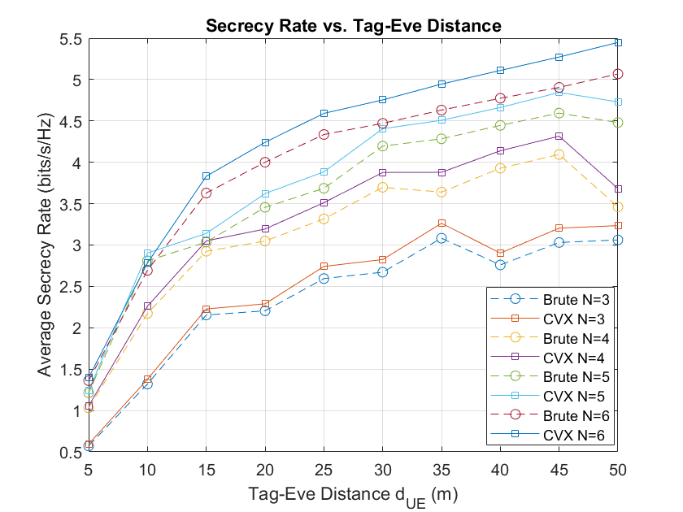
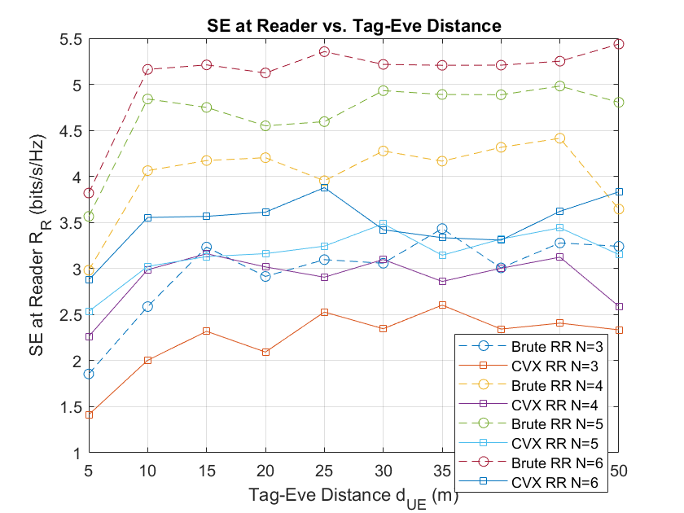
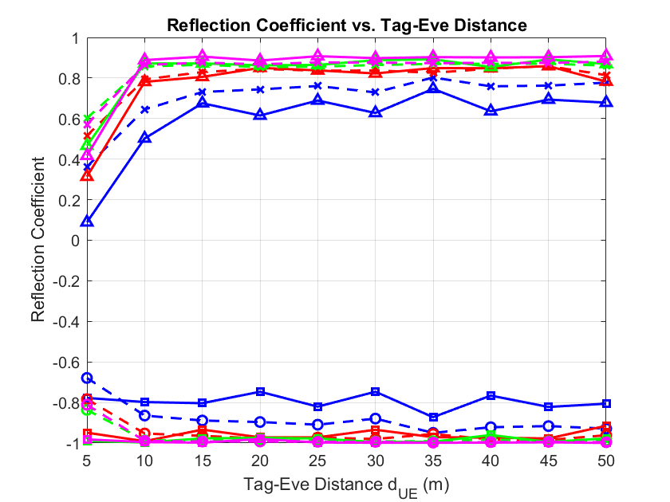
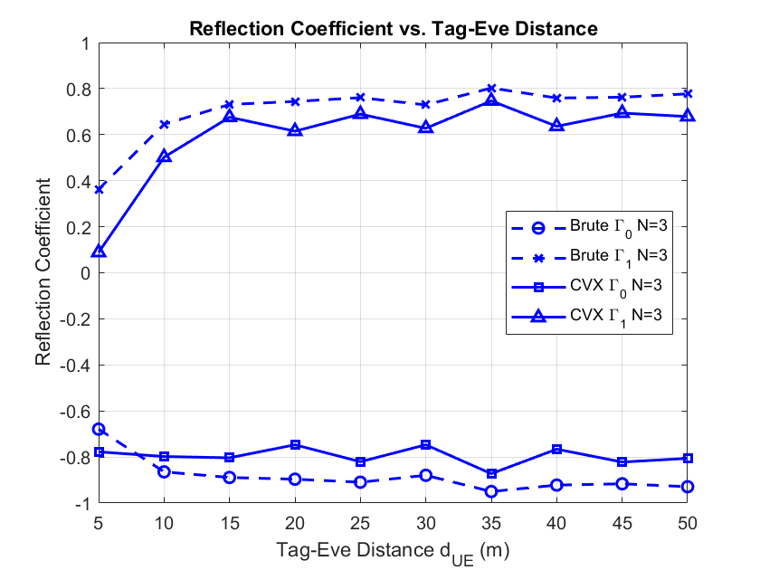
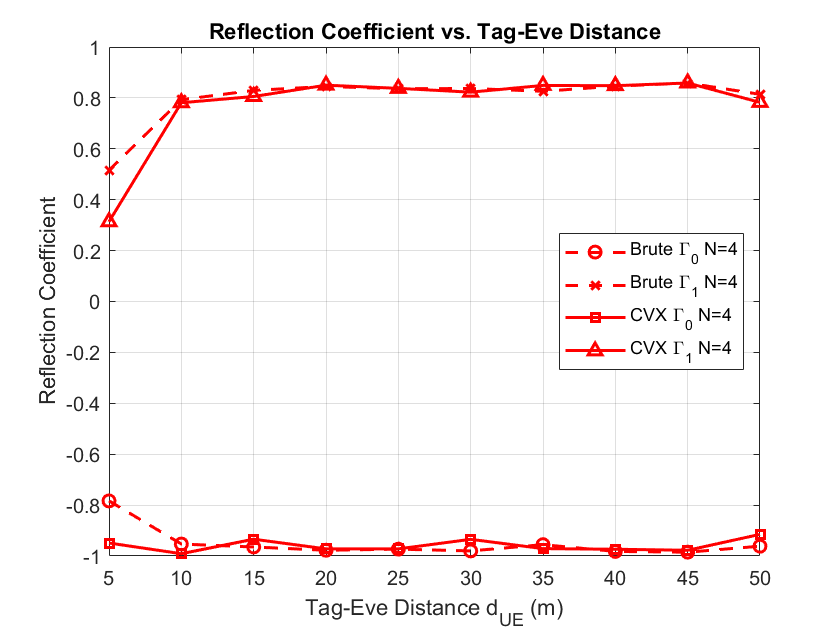
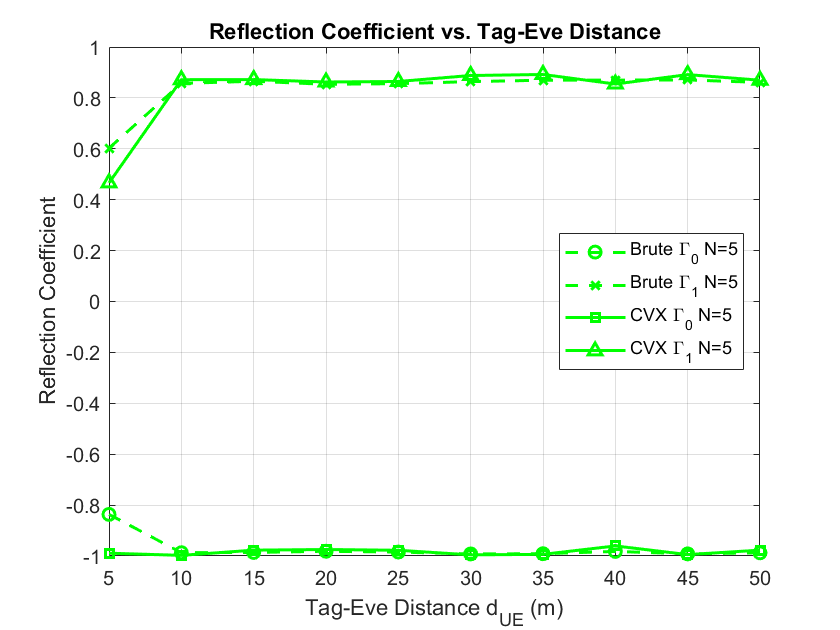
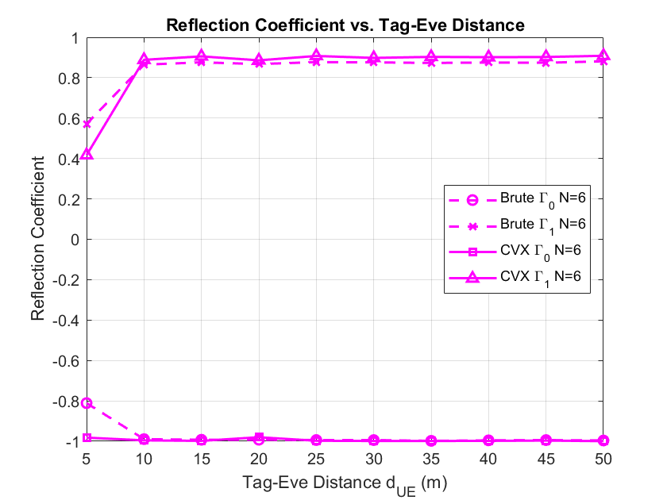
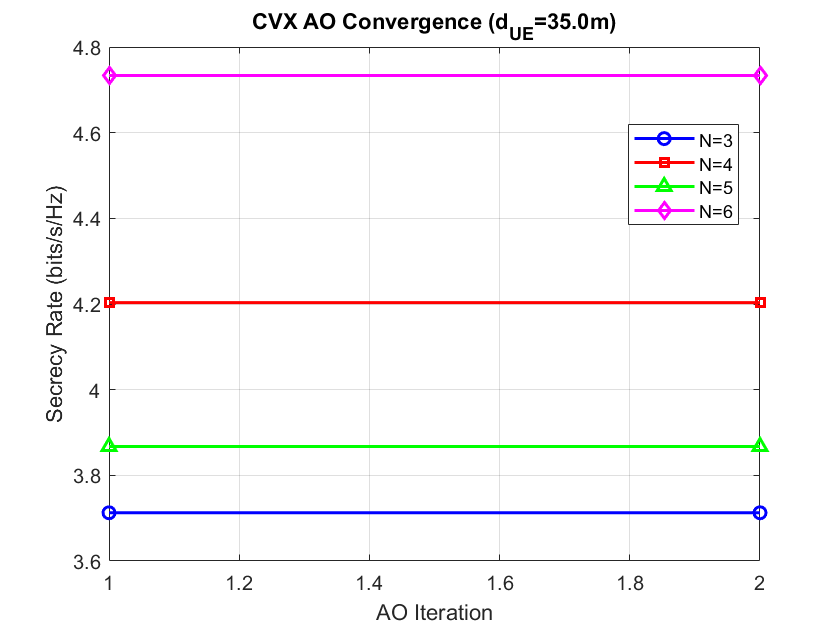
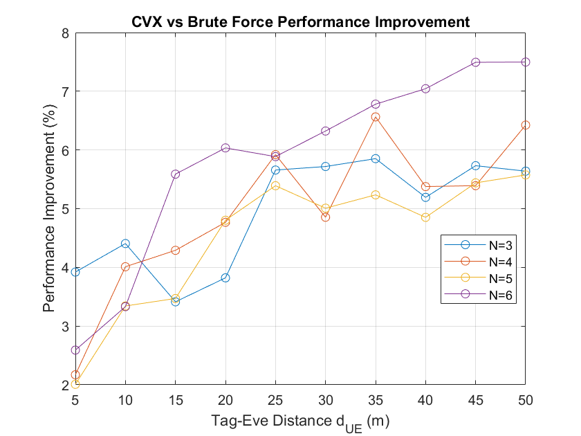
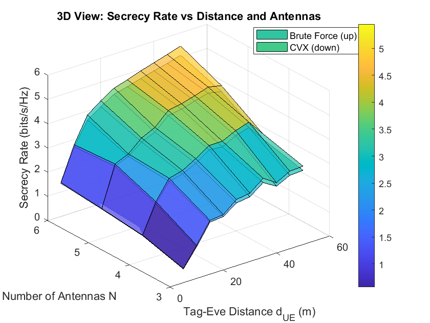

# ELEC9123 Design Task E (Optimization for Green IoT) - Term T2, 2025

**Project Title:** Secrecy Rate Maximization in Beamforming-Assisted Backscatter Communication (MIMO Reader, Single-Antenna Tag/Eavesdropper)

**Author:** Yuri Yu  
**Submission File:** `z5226692_Yu_DTE_2025.zip`


## Project Directory Structure

```
TaskE_Optimization_problem_of_green_iot/
├── Main/                       # Core simulation and algorithm scripts
│   ├── main_simulation.m       # Main simulation entry point
│   ├── bruteSR.m               # Brute force secrecy rate maximization
│   ├── cvxSR.m                 # AO/SCA-CVX secrecy rate maximization
│   ├── psoSR.m                 # PSO-based algorithm (if present)
│   └── README.txt              # Usage instructions for Main
├── Saved_Results_analysis/     # Post-simulation analysis and plotting
│   ├── main_post_analysis.m    # Main post-processing and plotting script
│   ├── load_and_analyze_data.m # Load and analyze simulation results
│   ├── save_simulation_data.m  # Save simulation results to .mat
│   ├── *.mat                   # Saved simulation and analysis results
│   └── README.txt              # Usage instructions for analysis
├── *.png, *.fig                # Figures and plots for the report
├── Design_Journal.md           # This design report
├── README.md                   # Project overview
└── ELEC9123_Design_Task_E_T2_2025_OGI.pdf # Task description
```

## Project Timeline

This project was initiated on Friday of Week 4 and is scheduled for final submission and presentation on Friday of Week 7. The following table outlines the three-week work plan:

| Week         | Dates (2025)         | Tasks and Milestones                                                                 |
|--------------|---------------------|--------------------------------------------------------------------------------------|
| **Week 5**   | Jun 5 – Jul 6       | - Literature review and system model formulation<br>- Mathematical problem definition<br>- Initial MATLAB code structure and parameter setup<br>- Report writing |
| **Week 6**   | Jul 7 – Jul 13     | - Implementation of brute-force and AO/SCA-based optimization algorithms<br>- Debugging and validation<br>- Preliminary simulation runs and result analysis<br>- Report writing |
| **Week 7**   | Jul 14 – May 18     | - Final simulations and result visualization<br>- Preparation of figures and discussion<br>- Report writing and polishing<br>- Submission and presentation (Friday) |

---

## 1. Introduction

Backscatter communication enables ultra-low-power IoT data collection, but the open nature of RF links makes tag messages vulnerable to eavesdropping. This project focuses on maximizing the **secrecy rate (SR)** in a system with a multi-antenna reader and a single-antenna tag/eavesdropper, using beamforming and tag impedance modulation, while ensuring energy harvesting and communication reliability.

> **Note:** Due to limited time, all simulation results in this report are based on 100 Monte Carlo runs per configuration. As a result, some figures may exhibit random fluctuations and may not be perfectly smooth or fully stable.

## 2. Objectives

- Develop a mathematical model for the multi-antenna reader ↔ single-antenna tag/eavesdropper system.
- Formulate the secrecy rate maximization problem with practical constraints.
- Implement both brute-force and efficient (AO/SCA-based) optimization algorithms.
- Simulate and analyze SR versus distance, number of antennas, etc.
- Summarize findings and propose future work.

## 3. System Model

### 3.1 Channel Model

- Reader-to-tag: $\mathbf{h}_{RU} \in \mathbb{C}^{N \times 1} \sim \mathcal{CN}(\mathbf{0}_{N \times 1}, \beta_{RU} \mathbf{I}_N)$  
- Path-loss: $\beta_{RU} = (\lambda/4\pi d_{RU})^2$ 
- Reader-to-eavesdropper: $\mathbf{h}_{RE} \in \mathbb{C}^{N \times 1} \sim \mathcal{CN}(\mathbf{0}_{N \times 1}, \beta_{RE} \mathbf{I}_N)$  
  > **Note:** In the secrecy rate analysis, we adopt a *worst-case assumption* where the eavesdropper is able to perfectly cancel the continuous wave (CW) signal transmitted by the reader [2].
- Tag-to-eavesdropper: $h_{UE} \in \mathbb{C} \sim \mathcal{CN}(0, \beta_{UE})$

### 3.2 Signal Model

- **Downlink (Reader to Tag):** $y_{bu} = \mathbf{h}_{RU}^T \mathbf{w} x_t + n_{bu} \approx \mathbf{h}_{RU}^T \mathbf{w} x_t$ (noise at tag is negligible [3]).
- **Tag Modulation (ASK):** $x_{b,i} = \sqrt{\eta_b} (\mathbf{h}_{RU}^T \mathbf{w} x_t) \Gamma_i$.
- **Uplink (Tag to Reader):** $y_{R,i} = \mathbf{h}_{RU}^H \mathbf{g} x_{b,i} + n_R$.
- **Eavesdropper Reception:** $y_{E,i} = h_{RE} x_{b,i} + n_E$.

### 3.3 SNR and Secrecy Rate

- **Legitimate Receiver:**
  $$
  \gamma_R = \frac{\eta_b |\mathbf{h}_{RU}^T \mathbf{w}|^2 |\mathbf{h}_{RU}^H \mathbf{g}|^2 |\Gamma_0 - \Gamma_1|^2}{4\sigma_R^2}
  $$
- **Eavesdropper:**
  $$
  \gamma_E = \frac{\eta_b |h_{UE}|^2 |\mathbf{h}_{RU}^T \mathbf{w}|^2 |\Gamma_0 - \Gamma_1|^2}{4\sigma_E^2}
  $$
- **Secrecy Rate:**
  $$
  SR = \log_2(1 + \gamma_R) - \log_2(1 + \gamma_E)
  $$

### 3.4 Optimization Problem Formulation

**Objective:** Jointly optimize the reader transmit beamforming vector $\mathbf{w}$ and tag reflection coefficients $(\Gamma_0, \Gamma_1)$ to maximize the system secrecy rate $SR$.

**Variables:**
- $\mathbf{w}$: Reader transmit beamforming vector
- $(\Gamma_0, \Gamma_1)$: Tag reflection coefficients

$$
\begin{align*}
\max_{\mathbf{w}, \mathbf{g}, \Gamma_0, \Gamma_1} \quad & SR(\mathbf{w}, \mathbf{g}, \Gamma_0, \Gamma_1) \\
\text{s.t.} \quad
& \|\mathbf{w}\|^2 \leq P_t, \|\mathbf{g}\|^2 \leq 1 \\
& \frac{|\Gamma_0 - \Gamma_1|}{2} \geq m_{th} \\
& -1 \leq \Gamma_0, \Gamma_1 \leq 1 \\
& P_{L,avg} = \eta_e \left(1 - \frac{|\Gamma_0|^2 + |\Gamma_1|^2}{2}\right) \mathbb{E}[|\mathbf{h}_{RU}^T \mathbf{w}|^2] \geq P_{th}
\end{align*}
$$

#### Optimization Problem

The resulting optimization problem is:
$$
\max_{\mathbf{w}, \mathbf{g}, \Gamma_0, \Gamma_1} \quad SR(\mathbf{w}, \mathbf{g}, \Gamma_0, \Gamma_1)
$$
where
$$
SR(\mathbf{w}, \mathbf{g}, \Gamma_0, \Gamma_1) = 
\log_2 \left( 1 + \frac{\eta_b |\mathbf{h}_{RU}^T \mathbf{w}|^2 |\mathbf{h}_{RU}^H \mathbf{g}|^2 |\Gamma_0 - \Gamma_1|^2}{4\sigma_R^2} \right) 
- 
\log_2 \left( 1 + \frac{\eta_b |\mathbf{h}_{RE}^T \mathbf{w}|^2 |\Gamma_0 - \Gamma_1|^2}{4\sigma_E^2} \right)
$$

#### Constraints

- **Average harvested power:** $P_{L,avg} \geq P_{th}$
- **Modulation depth:** $m = \frac{|\Gamma_0 - \Gamma_1|}{2} \geq m_{th}$
- **Beamforming/combining norm:** $\|\mathbf{w}\|^2 \leq P_t$, $\|\mathbf{g}\|^2 \leq 1$
- **Reflection coefficients:** $-1 \leq \Gamma_i \leq 1$

> **Note:** The derivation of the harvested power constraint is as follows:
>
> &emsp;The average harvested power at the tag is given by
> $$
> P_{L,avg} = \frac{1}{2}P_{L0} + \frac{1}{2}P_{L1} \geq P_{th}
> $$
> &emsp;where $P_{L0}$ and $P_{L1}$ are the harvested powers corresponding to reflection coefficients $\Gamma_0$ and $\Gamma_1$, respectively:
> $$
> P_{Li} = \eta_e (1 - |\Gamma_i|^2) \, \mathbb{E}\left[|\mathbf{h}_{RU}^T \mathbf{w}|^2\right], \quad i=0,1
> $$
> &emsp;Here, $\eta_e$ is the energy harvesting efficiency, and $\mathbb{E}\left[|\mathbf{h}_{RU}^T \mathbf{w}|^2\right]$ is the average received signal power at the tag.
>
> &emsp;Since the tag alternates between $\Gamma_0$ and $\Gamma_1$ with equal probability, the constraint simplifies to:
> $$
> P_{L,avg} = \eta_e \left(1 - \frac{|\Gamma_0|^2 + |\Gamma_1|^2}{2}\right) \mathbb{E}\left[|\mathbf{h}_{RU}^T \mathbf{w}|^2\right] \geq P_{th}
> $$
> &emsp;This compact form depends only on the average received power at the tag and the mean of $|\Gamma_0|^2$ and $|\Gamma_1|^2$, which facilitates optimization.

#### Simplified Optimization Problem

Moreover, It has been established in [1,2,3,4] that, for secrecy rate maximization with perfect CSI at the reader, the optimal receive combining vector is maximum ratio combining (MRC), i.e., $\mathbf{g} = \frac{\mathbf{h}_{RU}}{\|\mathbf{h}_{RU}\|}$. This is because the receive combining only affects the legitimate channel capacity and is independent of the eavesdropper’s channel. Furthermore, [5,6] demonstrate the optimality of MRC-based methods and confirm that increasing SNR monotonically improves channel capacity. Therefore, in this work, we always set $\mathbf{g}$ to the MRC solution and $\|\mathbf{g}\|^2 = 1$ to optimize SNR of legitimate channel. So the optimization problem can be simplified as:

$$
\max_{\mathbf{w}, \mathbf{g}, \Gamma_0, \Gamma_1} \quad SR(\mathbf{w}, \mathbf{g}, \Gamma_0, \Gamma_1)
$$
where
$$
SR(\mathbf{w}, \mathbf{g},\Gamma_0, \Gamma_1) = 
\log_2 \left( 1 + \frac{\eta_b |\mathbf{h}_{RU}^T \mathbf{w}|^2 \|\mathbf{h}_{RU}^H\|^2 |\Gamma_0 - \Gamma_1|^2}{4\sigma_R^2} \right) 
- 
\log_2 \left( 1 + \frac{\eta_b |h_{UE}|^2 |\mathbf{h}_{RU}^T \mathbf{w}|^2 |\Gamma_0 - \Gamma_1|^2}{4\sigma_E^2} \right)
$$

#### Constraints

- **Average harvested power:** $P_{L,avg} = \eta_e \left(1 - \frac{|\Gamma_0|^2 + |\Gamma_1|^2}{2}\right) \mathbb{E}\left[|\mathbf{h}_{RU}^T \mathbf{w}|^2\right] \geq P_{th}$
- **Modulation depth:** $m = \frac{|\Gamma_0 - \Gamma_1|}{2} \geq m_{th}$
- **Beamforming/combining norm:** $\|\mathbf{w}\|^2 \leq P_t$, $\|\mathbf{g}\|^2 = 1$, $\mathbf{g} = \frac{\mathbf{h}_{RU}}{\|\mathbf{h}_{RU}\|}$
- **Reflection coefficients:** $-1 \leq \Gamma_0, \Gamma_1 \leq 1$

## 4. Optimization Problem Analysis and Solution Methods

This section provides a detailed mathematical derivation and solution strategy for the secrecy rate maximization problem, based on the updated problem in Section 3.4. The main approach is based on Alternating Optimization (AO), with subproblems solved using SCA and grid search. 

> **Note:** The heuristic optimization method described below was not implemented in this work due to time constraints and is left as future work.

### 4.1 Problem Statement and Non-Convexity

The formulated problem is **non-convex** due to the coupling between $\mathbf{w}$ and $(\Gamma_0, \Gamma_1)$ in both the objective and the energy harvesting constraint. Note that the receive combining vector $\mathbf{g}$ has already been optimized via MRC and is no longer a variable in the problem.

**Brute Force Baseline as Benchmark:**  
In addition to the efficient algorithms, a brute force (exhaustive search) method is implemented and serves as a critical benchmark for this problem. The brute force approach discretizes the feasible domains of the beamforming vector $\mathbf{w}$ and the tag reflection coefficients $(\Gamma_0, \Gamma_1)$, enumerates all possible combinations, and selects the configuration that yields the highest secrecy rate while satisfying all constraints. This method guarantees the global optimum for small-scale problems, as it exhaustively searches the entire feasible space. Although computationally prohibitive for large-scale scenarios, brute force is invaluable for benchmarking: it provides a reference for the global optimum, allowing direct comparison and quantification of the optimality gap of more advanced algorithms such as AO/SCA and heuristic methods. This enables rigorous validation of the effectiveness and reliability of the proposed efficient algorithms.

### 4.2 AO-Based Solution: SCA for $\mathbf{w}$, Grid Search for $(\Gamma_0, \Gamma_1)$

#### 4.2.1 AO Framework

The main solution framework is Alternating Optimization (AO):

1. **Fix $(\Gamma_0, \Gamma_1)$, optimize $\mathbf{w}$ (Subproblem 1)**
2. **Fix $\mathbf{w}$, optimize $(\Gamma_0, \Gamma_1)$ (Subproblem 2)**
3. **Repeat until convergence**

#### 4.2.2 Subproblem 1: SCA-Based Optimization of $\mathbf{w}$

With $(\Gamma_0, \Gamma_1)$ fixed, the secrecy rate objective can be rewritten as:
$$
SR(\mathbf{w}) = \log_2\left(1 + a|\mathbf{h}_{RU}^T \mathbf{w}|^2\right) - \log_2\left(1 + b|\mathbf{h}_{RU}^T \mathbf{w}|^2\right)
$$
where $a = \frac{\eta_b \|\mathbf{h}_{RU}^H\|^2 |\Gamma_0 - \Gamma_1|^2}{4\sigma_R^2}$ and $b = \frac{\eta_b |h_{UE}|^2 |\Gamma_0 - \Gamma_1|^2}{4\sigma_E^2}$.

The constraints become:
- $\|\mathbf{w}\|^2 \leq P_t$
- $\eta_e \left(1 - \frac{|\Gamma_0|^2 + |\Gamma_1|^2}{2}\right) |\mathbf{h}_{RU}^T \mathbf{w}|^2 \geq P_{th}$

This subproblem is still non-convex due to the difference of concave functions. We use **Successive Convex Approximation (SCA)** to solve it:

- At each SCA iteration, linearize the concave part $f_2(\mathbf{w}) = \log_2(1 + b|\mathbf{h}_{RU}^T \mathbf{w}|^2)$ at the current point $\mathbf{w}^{(k)}$:
  $$
  f_2(\mathbf{w}) \approx f_2(\mathbf{w}^{(k)}) + \nabla f_2(\mathbf{w}^{(k)})^T (\mathbf{w} - \mathbf{w}^{(k)})
  $$
- The resulting problem is convex and can be efficiently solved using the CVX toolbox in MATLAB.

**SCA+CVX Implementation Steps:**
1. **Initialization:** $\mathbf{w}$ is initialized using the Maximum Ratio Transmission (MRT) principle, i.e., $\mathbf{w}^{(0)} = \sqrt{P_t} \frac{\mathbf{h}_{RU}^*}{\|\mathbf{h}_{RU}^*\|}$, which directs the transmit beam towards the tag to maximize received power. This provides a strong starting point for the iterative optimization.
2. At each iteration $k$:
   - Linearize $f_2(\mathbf{w})$ at $\mathbf{w}^{(k)}$.
   - Solve the convex problem for $\mathbf{w}^{(k+1)}$ using CVX.
   - Check convergence; if not, repeat.

#### 4.2.3 Subproblem 2: Grid Search for $(\Gamma_0, \Gamma_1)$

With $\mathbf{w}$ fixed, the secrecy rate is a function of $(\Gamma_0, \Gamma_1)$:
$$
SR(\Gamma_0, \Gamma_1) = \log_2\left(1 + c|\Gamma_0 - \Gamma_1|^2\right) - \log_2\left(1 + d|\Gamma_0 - \Gamma_1|^2\right)
$$
where $c = \frac{\eta_b |\mathbf{h}_{RU}^T \mathbf{w}|^2 \|\mathbf{h}_{RU}^H\|^2}{4\sigma_R^2}$ and $d = \frac{\eta_b |h_{UE}|^2 |\mathbf{h}_{RU}^T \mathbf{w}|^2}{4\sigma_E^2}$.

Constraints:
- $\frac{|\Gamma_0 - \Gamma_1|}{2} \geq m_{th}$
- $-1 \leq \Gamma_0, \Gamma_1 \leq 1$
- $\eta_e \left(1 - \frac{|\Gamma_0|^2 + |\Gamma_1|^2}{2}\right) |\mathbf{h}_{RU}^T \mathbf{w}|^2 \geq P_{th}$, where $|\mathbf{h}_{RU}^T \mathbf{w}|^2 $ is a constant

**Grid Search Implementation:**
- Discretize the feasible range of $\Gamma_0$ and $\Gamma_1$ (e.g., step size $\Delta$).
- For each pair $(\Gamma_0, \Gamma_1)$, check constraints and compute $SR$.
- Select the pair with the highest feasible secrecy rate.

#### 4.2.4 AO Algorithm Summary

**Algorithm Steps:**
1. Initialize $\mathbf{w}$ (using MRT as described above).  
2. **Initialize $(\Gamma_0, \Gamma_1)$ with values close to $\pm1$ (e.g., $\Gamma_0 = 0.8$, $\Gamma_1 = -0.8$), rather than exactly $1$ and $-1$.**  
   *Note: Setting $(\Gamma_0, \Gamma_1)$ to exactly $1$ and $-1$ is not practical, as the algorithm will not work properly in this case. Initializing with values such as $0.8$ and $-0.8$ ensures feasibility and stable algorithm performance.*
3. Repeat:
   - Fix $(\Gamma_0, \Gamma_1)$, optimize $\mathbf{w}$ via SCA+CVX.
   - Fix $\mathbf{w}$, optimize $(\Gamma_0, \Gamma_1)$ via grid search.
   - Check convergence.
4. Output the final solution.

**Advantages:**
- AO with SCA+CVX for $\mathbf{w}$ and grid search for $(\Gamma_0, \Gamma_1)$ is efficient and easy to implement.
- The method is guaranteed to converge to a stationary point.
- Initializing $\mathbf{w}$ with MRT and $(\Gamma_0, \Gamma_1)$ with values close to $\pm1$ (e.g., $0.8$, $-0.8$) provides fast convergence and robust performance.

---

### 4.3 Heuristic Optimization Method (Future Work)

> **Note:** The heuristic optimization method described in this section was not implemented in the current work due to time limitations. It is included here as a direction for future research.

As an alternative to the AO-based method, a heuristic approach can be used for faster, though potentially suboptimal, solutions. One such method is as follows:

#### 4.3.1 Heuristic Algorithm Outline

1. **Beamforming Heuristic:** Set $\mathbf{w}$ as the eigenvector corresponding to the largest eigenvalue of $\mathbf{h}_{RU}\mathbf{h}_{RU}^H$ (i.e., maximum ratio transmission towards the tag), scaled to satisfy the power constraint.
2. **Reflection Coefficient Heuristic:** Set $(\Gamma_0, \Gamma_1)$ to maximize modulation depth and energy harvesting, e.g., $\Gamma_0 = 1$, $\Gamma_1 = -1$, or select from a small set of candidate pairs that satisfy the constraints.
3. **Feasibility Check:** If the harvested power constraint is not satisfied, reduce $|\Gamma_0|$ and $|\Gamma_1|$ until the constraint is met.

#### 4.3.2 Implementation Steps

In this approach, the value of $\mathbf{w}$ is inspired by the Maximum Ratio Transmission (MRT) principle to heuristically select a near-optimal beamforming vector. Specifically:

- Compute $\mathbf{w}_{\text{heur}} = \sqrt{P_t} \frac{\mathbf{h}_{RU}^*}{\|\mathbf{h}_{RU}^*\|}$, i.e., direct the transmit beam towards the tag to maximize the received signal power, following the MRT strategy.
- For a small set of candidate $(\Gamma_0, \Gamma_1)$ pairs (e.g., $(0.5, -0.5)$, $(0.8, -0.8)$, etc.), check all constraints (such as energy harvesting and modulation depth), and compute the corresponding secrecy rate $SR$.
- Select the feasible $(\Gamma_0, \Gamma_1)$ pair that yields the highest secrecy rate.

**Advantages:**
- This method leverages the structure of MRT, greatly simplifying the beamforming design and resulting in extremely low computational complexity.
- It can serve as a good initial point for more advanced algorithms like AO, or as a fast suboptimal solution on its own.

## 5. Algorithm Implementation Flow

The following summarizes the algorithmic flow as implemented in the project's `main` directory MATLAB code:

1. **Brute-Force Baseline:**
   - The brute-force algorithm (see `main/bruteSR.m`) exhaustively searches over discretized feasible sets of the transmit beamforming vector $\mathbf{w}$ and the tag reflection coefficients $(\Gamma_0, \Gamma_1)$. For each combination, it evaluates all system constraints (power, modulation depth, energy harvesting) and computes the secrecy rate (SR).
   - This approach guarantees the global optimum for small-scale problems (e.g., $N=3,4,5,6$ antennas), serving as a gold-standard benchmark for algorithm validation.
   - The brute-force results are used to directly quantify the optimality gap and performance of more advanced algorithms, such as AO/SCA and heuristic methods.

2. **Efficient Algorithm (AO/SCA + Grid Search):**
   - The Alternating Optimization (AO) algorithm, implemented in the codebase, alternates between optimizing the beamforming vector $\mathbf{w}$ (using Successive Convex Approximation (SCA) and CVX) and the reflection coefficients $(\Gamma_0, \Gamma_1)$ (using grid search).
   - Initialization: $\mathbf{w}$ is initialized using Maximum Ratio Transmission (MRT), and $(\Gamma_0, \Gamma_1)$ are initialized with feasible values close to $\pm1$ (e.g., $0.8$, $-0.8$) to ensure algorithm stability and constraint satisfaction.
   - Iterative Steps:
     - Fix $(\Gamma_0, \Gamma_1)$, optimize $\mathbf{w}$ via SCA+CVX.
     - Fix $\mathbf{w}$, optimize $(\Gamma_0, \Gamma_1)$ via grid search.
     - Repeat until convergence.
   - This method achieves efficient and robust performance, converging to a stationary point with much lower computational complexity than brute-force.

3. **Heuristic Algorithm:**
   - *Not implemented in the current code due to time constraints. See Section 4.3 for a proposed heuristic approach for future work.*

4. **Performance Evaluation:**
   - The code compares secrecy rate, harvested energy, variable distributions, and computational complexity across algorithms.
   - The brute-force method provides a global optimum reference, while AO/SCA demonstrates practical efficiency and near-optimal performance.

## 6. Simulation Setup

### 6.1 Default Simulation Parameters

| Parameter                              | Notation   | Value      | Unit      |
|-----------------------------------------|------------|------------|-----------|
| RF Frequency                           | $f$        | 915        | MHz       |
| Speed of Light                         | $c$        | $3 \times 10^8$ | m/s      |
| Transmission Power                     | $P_t$      | 0.5        | W         |
| Noise Power at Reader                  | $\sigma^2_R$ | -80      | dBm       |
| Noise Power at Eavesdropper            | $\sigma^2_E$ | -80      | dBm       |
| Backscattering Efficiency              | $\eta_b$   | 0.8        | -         |
| Energy Harvesting Efficiency           | $\eta_e$   | 0.8        | -         |
| Reader-Tag Distance                    | $d_{RU}$   | 10         | m         |
| Harvested Power Threshold              | $P_{th}$   | $10^{-6}$  | W         |
| Modulation Depth Threshold             | $m_{th}$   | 0.2        | -         |

---

- **Reader-Tag Distance ($d_{RU}$):** 5–50 m (step size: 5 m)
- **Number of Antennas ($N$):** $\{3,4,5,6\}$
- **Monte Carlo Runs:** 100 per configuration

> **Note:** Due to time constraints, only 100 Monte Carlo runs are performed per simulation point. As a result, the plotted curves may exhibit some random fluctuations and may not be perfectly smooth.

**Simulation Procedure:**
- For each Monte Carlo run, independent channel realizations are generated.
- For each realization, the secrecy rate maximization problem is solved using both the brute-force and AO/SCA+grid search algorithms (the heuristic algorithm is not included in the current results).
- Results are recorded and averaged to obtain the final performance metrics for each configuration.

## 7. Results and Discussion

This section presents a comprehensive analysis of the simulation results, focusing on the impact of system parameters on secrecy rate, reflection coefficients, and algorithmic performance. All figures are carefully arranged and renamed for clarity, and key conclusions are drawn from the data.

> **Note:** In both the Brute Force and AO/SCA-CVX algorithms, the receive combining vector $\mathbf{g}$ is always set to the maximum ratio combining (MRC) solution. This is because, as established in the literature and in Section 3.4, MRC is optimal for maximizing the legitimate channel SNR and thus is adopted for all algorithms to ensure a fair comparison.

> **Note:** All simulation results are based on 100 Monte Carlo runs per configuration due to time constraints. As a result, the plotted curves may show some random perturbations and are not as smooth or stable as those generated from a larger number of trials.

### 7.1 Simulation Setup Overview

To comprehensively evaluate secrecy rate maximization in beamforming-assisted backscatter communication, simulations were performed across a range of system parameters. The number of reader antennas was set to $N = \{3, 4, 5, 6\}$, and the Tag-Eve distance $d_{UE}$ was varied from 5.0 m to 50.0 m in 5 m increments. For each configuration, 100 Monte Carlo trials were conducted to ensure statistical reliability. Due to the limited number of trials, some figures may exhibit random fluctuations.

### 7.2 Secrecy Rate Performance: Impact of Antennas and Distance

**Figure 7.1: Secrecy Rate vs. Tag-Eve Distance for Different $N$**

<p align="center">
  <b>Figure 7.1</b>: <i>Secrecy Rate as a Function of Tag-Eve Distance for N=3,4,5,6 (Comparison of Brute Force and AO/SCA-CVX Algorithms).</i><br>
  
</p>

The results in Figure 7.1 clearly show that the secrecy rate (SR) increases with both the number of antennas and the Tag-Eve distance. The AO/SCA-CVX algorithm consistently outperforms the Brute Force baseline, with an average secrecy rate improvement of **5.07%**. Specifically, the Brute Force SR ranges from 0.5713 to 5.0683 bits/s/Hz, while the AO/SCA-CVX SR ranges from 0.5937 to 5.4483 bits/s/Hz. The highest secrecy rates are achieved at $N=6$ and $d_{UE}=50.0$ m.


**Table 7.1: Secrecy Rate Statistics**

| Method        | Mean SR (bits/s/Hz) | Std. Dev. | Min   | Max   |
|---------------|---------------------|-----------|-------|-------|
| Brute Force   | 3.2708              | 1.1431    | 0.5713| 5.0683|
| AO/SCA-CVX    | 3.4483              | 1.2299    | 0.5937| 5.4483|

The rate of SR improvement with distance also increases as $N$ grows, highlighting the benefit of larger antenna arrays in mitigating eavesdropping threats.

**Table 7.2: SR Change Rate with Distance (bits/s/Hz/m)**

| N | Brute Force | AO/SCA-CVX |
|---|-------------|------------|
| 3 | 0.0486      | 0.0520     |
| 4 | 0.0515      | 0.0556     |
| 5 | 0.0630      | 0.0676     |
| 6 | 0.0686      | 0.0758     |

### 7.3 Additional Insights: Secrecy Rate vs. Spectral Efficiency

**Figure 7.4: Reader Spectral Efficiency $R_R$ vs. Tag-Eve Distance**

<p align="center">
  <b>Figure 7.4</b>: <i>Reader Spectral Efficiency as a Function of Tag-Eve Distance.</i><br>
  
</p>

From Figure 7.4, it is evident that the AO/SCA-CVX algorithm yields a lower reader spectral efficiency $R_R$ compared to the Brute Force (BF) method. However, as shown in Figure 7.1, the secrecy rate (SR) achieved by AO/SCA-CVX is actually higher than that of BF. This indicates that maximizing $R_R$ alone does not necessarily lead to the highest secrecy rate. In fact, by slightly reducing $R_R$, the AO/SCA-CVX approach is able to more significantly suppress the eavesdropper's channel capacity $R_E$, resulting in a larger difference $SR = [R_R - R_E]^+$. Therefore, the key to improving secrecy performance lies in jointly considering both $R_R$ and $R_E$, rather than focusing solely on maximizing the legitimate channel's spectral efficiency. A strategic trade-off between these two metrics is essential for achieving optimal secrecy rate.

### 7.4 Optimal Configuration and Parameter Insights

**Table 7.3: Best Achievable Secrecy Rate and Reflection Coefficients**

| Method         | $N$ | $d_{UE}$ (m) | SR (bits/s/Hz) | $\Gamma_0$   | $\Gamma_1$   |
|----------------|-----|--------------|----------------|--------------|--------------|
| Brute Force    | 6   | 50.0         | 5.0683         | -0.9960      | 0.8810       |
| AO/SCA-CVX     | 6   | 50.0         | 5.4483         | -0.9995      | 0.9085       |

These results confirm that joint optimization of beamforming and reflection coefficients via AO/SCA-CVX achieves the best secrecy performance, especially with more antennas and greater eavesdropper distance.

### 7.5 Analysis of Optimized Reflection Coefficients

**Figure 7.2: Optimized Reflection Coefficients $(\Gamma_0, \Gamma_1)$ vs. Tag-Eve Distance**

<p align="center">
  <b>Figure 7.2</b>: <i>Optimized Reflection Coefficients $(\Gamma_0, \Gamma_1)$ as Functions of Tag-Eve Distance for N=3,4,5,6.</i><br>
  
</p>

**Figure 7.3: Separated Plots for Each $N$**

<p align="center">
  <b>Figure 7.3</b>: <i>Optimized Reflection Coefficients for (a) N=3, (b) N=4, (c) N=5, (d) N=6.</i><br>
  
  
  
  
</p>

A particularly important observation is that the optimized reflection coefficients $\Gamma_0$ and $\Gamma_1$ are approximately negatives of each other, i.e., $\Gamma_0 \approx -\Gamma_1$. This phenomenon can be explained as follows: In backscatter modulation, maximizing the modulation depth $|\Gamma_0 - \Gamma_1|$ directly enhances the distinguishability between the two tag states, which in turn improves the legitimate channel’s SNR and the overall secrecy rate. The largest possible modulation depth under the physical constraint $|\Gamma_i| \leq 1$ is achieved when $\Gamma_0$ and $\Gamma_1$ are equal in magnitude but opposite in sign. This configuration not only maximizes $|\Gamma_0 - \Gamma_1| = |(-a) - a| = 2|a|$ (with $|a|$ as large as allowed by the energy harvesting constraint), but also ensures that the tag’s two states are as distinct as possible. As a result, the optimizer naturally selects $\Gamma_0$ and $\Gamma_1$ to be nearly symmetric about zero, subject to the minimum modulation depth and energy harvesting requirements.

The simulation results confirm this: $\Gamma_0$ is negative (typically between $-0.7$ and $-1$), and $\Gamma_1$ is positive (typically between $0.4$ and $0.9$), corresponding to the two modulation states of the tag. After an initial transition, both coefficients stabilize as $d_{UE}$ increases, indicating that the optimal values are robust to eavesdropper distance beyond a certain point. As $N$ increases, the modulation depth $|\Gamma_0 - \Gamma_1|$ also increases, further enhancing secrecy performance. The near-identical results from Brute Force and AO/SCA-CVX confirm the reliability and convergence of the proposed optimization framework. All solutions satisfy the physical constraints, including energy harvesting and minimum modulation depth.

### 7.6 Additional Performance Metrics

**Figure 7.5: Secrecy Rate Convergence Curve (AO/SCA Iterations)**

<p align="center">
  <b>Figure 7.5</b>: <i>Convergence of Secrecy Rate over AO/SCA Iterations.</i><br>
  
</p>

The AO/SCA+CVX algorithm demonstrates extremely fast convergence: with a convergence tolerance of $10^{-4}$, the algorithm typically converges within just two iterations. Even with a tighter tolerance of $10^{-6}$, convergence is still achieved by the second iteration, indicating that the algorithm rapidly reaches the optimal solution. This highlights the high efficiency and practical viability of the proposed AO/SCA+CVX approach.

### 7.7 Percentage Improvement and 3D Visualization

**Figure 7.6: Percentage Improvement of AO/SCA-CVX over Brute Force**

<p align="center">
  <b>Figure 7.6</b>: <i>Percentage Secrecy Rate Improvement of AO/SCA-CVX over Brute Force Baseline.</i><br>
  
</p>

Figure 7.6 further quantifies the performance gain of AO/SCA-CVX over the Brute Force method. The percentage improvement increases with both the number of antennas and the Tag-Eve distance, confirming that the proposed algorithm is especially advantageous in large-scale or high-security scenarios.

**Figure 7.7: 3D Visualization of Secrecy Rate vs. $N$ and $d_{UE}$**

<p align="center">
  <b>Figure 7.7</b>: <i>3D Surface Plot of Secrecy Rate as a Function of Number of Antennas and Tag-Eve Distance.</i><br>
  
</p>

The 3D visualization in Figure 7.7 provides an intuitive overview of how secrecy rate scales with both the number of antennas and the Tag-Eve distance. The surface plot clearly shows that secrecy rate increases monotonically with both parameters, and the AO/SCA-CVX algorithm consistently achieves higher values across the entire parameter space.

> **Note:** The 3D surface and all other figures may show some random noise due to the limited number of Monte Carlo runs.

### 7.8 Summary and Key Conclusions

Based on the above analysis and simulation results, the following conclusions can be drawn:

- **Consistent Outperformance:** The AO/SCA-CVX algorithm consistently achieves higher secrecy rates than the Brute Force baseline, with the performance gap widening as the number of antennas and Tag-Eve distance increase.
- **Physical Interpretability:** The optimized reflection coefficients are nearly symmetric about zero, maximizing modulation depth within physical and energy harvesting constraints. This configuration is robust to changes in eavesdropper distance and is further enhanced by larger antenna arrays.
- **Rapid Convergence:** The AO/SCA-CVX algorithm converges extremely quickly, typically within two iterations, making it highly suitable for practical deployment.
- **Design Guidelines:** The best secrecy performance is obtained with the largest antenna array and maximum Tag-Eve separation, providing clear guidance for secure and energy-efficient backscatter system design.
- **Trade-off Insight:** Maximizing the reader's spectral efficiency does not always maximize secrecy rate. A moderate reduction in $R_R$ can be offset by a greater reduction in $R_E$, leading to improved secrecy. Thus, joint optimization of both metrics is essential for secure system design.

All analysis results and figures have been saved in `post_analysis_results.mat` for reproducibility and further reference.

> **Note:** The heuristic optimization method was not implemented in this work and is left as future work.

## 8. References

1. Deepak Mishra and Erik G. Larsson, "Optimal Channel Estimation for Reciprocity-Based Backscattering With a Full-Duplex MIMO Reader," *IEEE Transactions on Signal Processing*, vol. 65, no. 15, pp. 3952-3966, Aug. 2017.
2. W. Saad, X. Zhou, Z. Han, and H. V. Poor, “On the physical layer security of backscatter wireless systems,” *IEEE Trans. Wireless Commun.*, vol. 13, no. 6, pp. 3442–3451, Jun. 2014.
3. Amus Goay, Tianyi Zhang. ELEC9123: Design Task E (Optimization for Green IoT) – Secrecy Rate Maximization in Beamforming-Assisted Backscatter Communication. Term T2, 2025.
4. E. Campbell, M. Mohammadi, D. Mishra, and M. Matthaiou, "Beamforming and Power Allocation Design for Secure Backscatter Communication," *Proc. IEEE International Conference on Communications (ICC)*, 2023.
5. A. Goldsmith, “Wireless Communications,” *Cambridge University Press*, 2005.
6. D. Tse, P. Viswanath, “Fundamentals of Wireless Communication,” *Cambridge University Press*, 2005.


## Acknowledgement
This work was completed with the help of Cursor IDE and its AI assistant, which provided technical support in simulation design, MATLAB scripting, LaTeX formatting, and academic writing assistance throughout the project.

## Appendix A: Non-Convex Optimization Methods and Theoretical Analysis

This appendix provides a comprehensive overview of the non-convex optimization techniques employed in the secrecy rate maximization problem for beamforming-assisted backscatter communication. The focus is on Successive Convex Approximation (SCA), grid search, and heuristic methods, as well as theoretical analyses regarding convergence, complexity, and error bounds.

### A.1 Principles and Mathematical Formulation

The secrecy rate maximization problem is inherently non-convex due to the coupled variables and the fractional, non-linear structure of the objective function. The general form is:

$$
\max_{\mathbf{w}, \Gamma_0, \Gamma_1} \quad R_s(\mathbf{w}, \Gamma_0, \Gamma_1)
$$
$$
\text{s.t.} \quad \mathbf{w} \in \mathcal{W}, \quad (\Gamma_0, \Gamma_1) \in \mathcal{G}, \quad \text{EH and modulation constraints}
$$

where $R_s$ is the secrecy rate, $\mathcal{W}$ is the feasible set for the beamforming vector, and $\mathcal{G}$ is the feasible set for the tag reflection coefficients.

#### DC Programming

The secrecy rate can often be expressed as the difference of two concave (or convex) functions, e.g.,

$$
R_s = \left[\log_2(1+\gamma_R) - \log_2(1+\gamma_E)\right]^+
$$

where $\gamma_R$ and $\gamma_E$ are SNRs at the legitimate receiver and eavesdropper, respectively. DC programming decomposes the objective into convex and concave parts and iteratively linearizes the concave part using first-order Taylor expansion:

$$
f(x) - g(x) \approx f(x) - \left[g(x^{(k)}) + \nabla g(x^{(k)})^T (x - x^{(k)})\right]
$$

This transforms the problem into a sequence of convex subproblems.

#### SCA (Successive Convex Approximation)

SCA generalizes DC by approximating non-convex constraints and objectives with convex surrogates at each iteration, ensuring tractable optimization and convergence to a stationary point.

#### SDR (Semidefinite Relaxation)

For quadratic forms in $\mathbf{w}$, SDR lifts the problem to a higher-dimensional semidefinite matrix variable, relaxing the rank constraint. The optimal solution is then approximated by randomization or rank-1 extraction.

#### Grid Search

Grid search discretizes the feasible domains (e.g., for $\Gamma_0$, $\Gamma_1$) and exhaustively evaluates the objective for all combinations. While globally optimal for small problems, it is computationally prohibitive for high-dimensional cases.

---

#### Brute Force Baseline

To provide a global optimum reference for the secrecy rate maximization problem, a brute force (exhaustive search) method is implemented. This approach discretizes the feasible domains of the beamforming vector $\mathbf{w}$ and the tag reflection coefficients $(\Gamma_0, \Gamma_1)$, enumerates all possible combinations, and selects the configuration that yields the highest secrecy rate while satisfying all constraints. Although computationally prohibitive for large-scale problems, brute force is invaluable for small-scale scenarios, as it guarantees the global optimum and serves as a benchmark for evaluating the performance and optimality gap of more efficient algorithms (such as AO/SCA and heuristic methods).

---

### A.2 DC Decomposition and First-Order Approximation

The secrecy rate objective is decomposed as:

$$
R_s(\mathbf{w}, \Gamma_0, \Gamma_1) = f_1(\mathbf{w}, \Gamma_0, \Gamma_1) - f_2(\mathbf{w}, \Gamma_0, \Gamma_1)
$$

where $f_1$ and $f_2$ are convex (or concave) functions of the variables. At each iteration $k$, $f_2$ is linearized at the current point, yielding a convex approximation:

$$
f_2(\mathbf{x}) \approx f_2(\mathbf{x}^{(k)}) + \nabla f_2(\mathbf{x}^{(k)})^T (\mathbf{x} - \mathbf{x}^{(k)})
$$

This enables efficient solution via convex optimization solvers.

### A.3 Feasible Set Analysis and Constraints

- **Beamforming Vector ($\mathbf{w}$):** Typically constrained by transmit power, i.e., $\|\mathbf{w}\|^2 \leq P_t$.
- **Reflection Coefficients ($\Gamma_0$, $\Gamma_1$):** Subject to physical realizability, e.g., $|\Gamma_i| \leq 1$, and minimum modulation depth $|\Gamma_0 - \Gamma_1| \geq \Delta_{\min}$.
- **Energy Harvesting (EH):** The tag must harvest sufficient energy, leading to constraints such as $E_{\text{harvested}} \geq E_{\min}$.

The feasible set is thus the intersection of these convex and non-convex constraints.

### A.4 Convergence and Theoretical Guarantees

- **DC/SCA:** Both methods guarantee convergence to a stationary point (KKT point) under mild regularity conditions, as each iteration solves a convex approximation and the objective is non-decreasing.
- **SDR:** Provides an upper bound to the original problem. If the solution is rank-1, it is globally optimal; otherwise, randomization yields a near-optimal feasible solution.
- **Grid Search:** Guarantees global optimality within the discretization granularity, but suffers from exponential complexity.

### A.5 Complexity and Error Analysis

- **DC/SCA:** Each iteration involves solving a convex problem (e.g., SOCP or SDP), with per-iteration complexity polynomial in the number of variables. The total complexity is $O(K \cdot \text{poly}(n))$, where $K$ is the number of iterations.
- **SDR:** Complexity is dominated by the SDP solver, typically $O(n^6)$ for $n \times n$ matrices.
- **Grid Search:** Complexity is $O(M^d)$, where $M$ is the number of grid points per variable and $d$ is the number of discretized variables.
- **Error Bounds:** For grid search, the maximum error is bounded by the grid resolution. For DC/SCA, the solution is locally optimal; global optimality is not guaranteed due to non-convexity, but empirical results show near-optimal performance.

### A.6 Summary Table

| Method      | Optimality      | Complexity         | Convergence      | Error Bound         |
|-------------|----------------|--------------------|------------------|---------------------|
| DC/SCA      | Local optimum  | Polynomial/iter.   | Guaranteed       | Stationary point    |
| SDR         | Upper bound / near-optimal | High (SDP) | Guaranteed       | Gap to rank-1       |
| Grid Search | Global (discrete) | Exponential      | Trivial          | Grid resolution     |

---

This appendix provides the theoretical foundation and practical considerations for the optimization algorithms used in this project. Detailed derivations and proofs can be provided upon request.